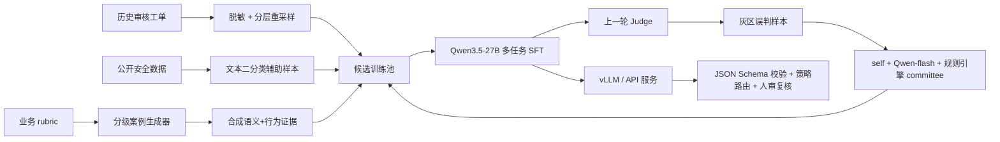

# IM 私聊违规审核模型面试讲解手册

## 30 秒版本

这个项目把直播/社交 IM 私聊审核从“只看聊天文本的安全二分类”升级成“语义证据 + 行为证据融合的多任务审核 Judge”。我把 11 类业务违规主题拆成 47 个子主题，设计低/中/高三级风险 rubric，并在 Qwen3.5-27B 上做 completion-only SFT，让单模型同时输出风险等级、是否违规、处置建议、关联分析和判定依据。最终在 1024 条人审测试集上，违规判定 Acc 82.1，risk macro-F1 75.6，handling macro-F1 73.2，ban_account FPR 控到 2.6%。

如果你用当前 GitHub 仓库作为个人作品集，建议使用更稳妥的版本：

> 这个项目是一个 IM 私聊风控审核的生产化展示工程。我把传统 safe/unsafe 文本审核升级成“聊天语义 + 行为异常”的多证据审核 Judge，统一输出风险等级、违规判定、处置建议和解释依据。仓库里接入了 Apache-2.0 的公开 XGuard 数据，补齐了数据转换、质量审计、FastAPI 服务、鉴权、审计持久化、Prometheus 指标、drift 检测、部署模板、模型注册表和 GitHub Actions 企业验收门禁。它不声称包含真实公司数据和线上 checkpoint，但能证明我知道一个 LLM 风控系统从训练到上线需要哪些工程边界。

## 2 分钟版本

业务问题是原系统只能判断 safe/unsafe，无法消费异地登录、关注、进房、打赏冲榜等行为信号，也不能支撑 warning、limit、ban 这种差异化处置。我做了三件事：

1. 重新定义输出协议：`risk_level + final_judgment + handling_suggestion + correlation_analysis + judgment_basis`，让模型输出能直接被下游策略、人审复核和数据看板消费。
2. 重新构造训练数据：历史工单脱敏分层重采样约 24.5K，按 risk_level 训练生成器合成约 11.6K，三轮灰区样本 refinement 约 2.6K，再叠加 12.7K 公开安全数据做文本侧辅助。
3. 训练统一多任务模型：Qwen3.5-27B completion-only SFT，公开数据只对 final_judgment 算 loss，内部数据对三层标签和解释字段共同监督。

项目价值主要体现在 mid_risk 灰区：相对 Qwen3.6-plus zero-shot，mid_risk Acc 提升 10.1pp；去掉行为证据后 risk macro-F1 掉 7.8pp，证明行为证据融合是最大单点贡献。

## 架构讲解



## 面试重点

- 为什么不是 prompt API：三层输出容易自相矛盾，业务处置档位需要模型显式学习。
- 为什么不是三个模型：成本高、延迟高、输出容易冲突；多任务共享语义和证据理解表示。
- 为什么要行为证据：IM 风控里很多灰产话术语义很淡，必须靠打赏、进房、关注、登录等行为印证。
- 为什么 completion-only：prompt 里有 rubric 和策略表，loss 不应该浪费在复述 prompt 上。
- 为什么看 macro-F1 和 ban FPR：类别不均衡，业务最关心 limit/ban 等少数但高代价档位。
- 最大工程风险：上游行为特征质量，灰度期间曾因 `gift_total_value` 默认值异常导致 ban FPR 升高。

## 本仓库怎么展示

```bash
python3 -m venv .venv
source .venv/bin/activate
pip install -e ".[dev,serve]"

make enterprise-check
make predict-route
make eval-report
```

没有模型权重时，CLI 使用启发式 Judge 演示协议闭环；有 fine-tuned checkpoint 时传 `--model-path outputs/im-audit-judge` 即可切到真实 Transformers 推理。面试时要主动说明：本仓库证明的是工程体系和接入点，真实上线还需要替换内部业务数据、真实 checkpoint、企业网关、人审平台和集中审计系统。
