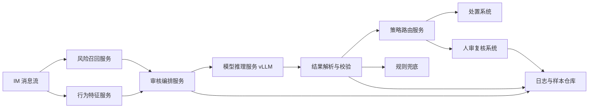
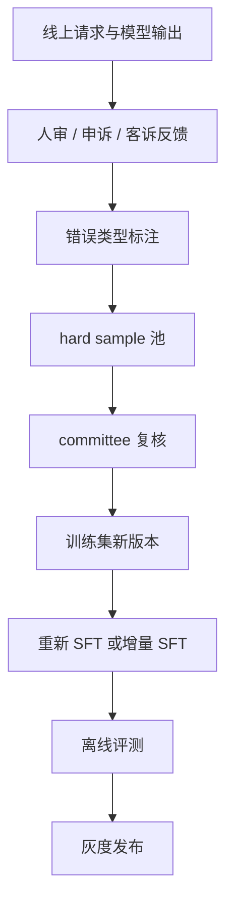

# 生产级系统设计：IM 私聊违规审核 Judge

这份文档回答面试里更工程化的问题：如果不是写 demo，而是真的让你把这个模型接进公司生产环境，你会怎么拆服务、怎么定义接口、怎么做数据闭环、怎么上线和兜底。

## 1. 生产目标

系统目标不是“调用一次大模型”，而是稳定处理 IM 私聊审核流量，并把模型结论变成业务可执行动作。

核心要求：

- 支持聊天语义证据和行为异常证据联合审核。
- 输出结构化 JSON，能被策略系统、人审系统、数据看板消费。
- `ban_account` 等高风险处置必须可解释、可复核、可回滚。
- 模型异常、解析失败、上游特征异常时有兜底链路。
- 支持样本回流和模型周期迭代。

## 2. 服务边界



各模块职责：

- 风险召回服务：从 IM 消息中召回关键聊天证据，输出 `chat_evidence_list`。
- 行为特征服务：聚合登录、关注、进房、打赏、消费等行为，输出 `behavior_key_summary` 和 `behavior_abnormal_list`。
- 审核编排服务：组装模型输入、选择 rubric、调用推理服务。
- 模型推理服务：vLLM 部署 Qwen SFT checkpoint，负责生成审核 JSON。
- 结果解析与校验：解析 JSON、校验枚举、处理字段冲突。
- 策略路由服务：把模型建议映射到业务动作或人审队列。
- 样本仓库：保存输入、输出、人审结论、线上反馈，支撑后续训练。

## 3. 核心接口

### 3.1 审核请求

```json
{
  "request_id": "req-20260424-0001",
  "ticket_id": "im-audit-2026-04-24-008721",
  "audit_scene": {
    "chat_type": "IM私聊",
    "user_intimacy": "无",
    "behavior_key_summary": {
      "login_behavior": "异地登录。",
      "search_behavior": "搜索 UID。",
      "follow_behavior": "关注。",
      "enter_room_behavior": "进入对方房间。",
      "t_bean_consume": "极大额消费。",
      "reward_behavior": "持续高频大额打赏。",
      "gift_total_value": 10000,
      "gift_total_count": 5
    }
  },
  "chat_evidence_list": [
    {
      "occur_time": "2026-04-24 19:00:00",
      "original_content": "帮我代刷一下今晚的周榜，包榜到第一。",
      "risk_point": "明确提及代刷和包榜。"
    }
  ],
  "behavior_abnormal_list": [
    {
      "abnormal_type": "代刷/包榜行为",
      "abnormal_description": "短时间突发性大额打赏，疑似冲榜。"
    }
  ],
  "hint_topic": "代刷/包榜"
}
```

### 3.2 审核响应

```json
{
  "request_id": "req-20260424-0001",
  "model_version": "im-judge-qwen27b-v3",
  "parse_status": "ok",
  "risk_level": "high_risk",
  "topic": "代刷/包榜",
  "correlation_analysis": "语义中明确约定代刷包榜，行为侧大额打赏与冲榜目标相互印证。",
  "final_judgment": "exist_violation",
  "judgment_basis": "明确代刷约定加突发大额打赏，证据链完整。",
  "handling_suggestion": "ban_account",
  "route": "human_review_required"
}
```

## 4. 后处理规则

模型输出不能直接落业务动作，必须过后处理层。

本仓库对应实现：`src/im_guard_ml/postprocess.py`。核心职责是把模型预测结果转成生产可消费结果，包括字段校验、冲突修正、重处罚保护和策略路由。

字段校验：

- `risk_level` 必须是 `low_risk / mid_risk / high_risk`。
- `final_judgment` 必须是 `exist_violation / not_exist_violation`。
- `handling_suggestion` 必须是 `ignore / warning / limit_account / ban_account`。
- `topic` 必须属于业务主题清单或 `无主题`。

逻辑校验：

- `not_exist_violation` 不允许直接 `limit_account` 或 `ban_account`。
- `ban_account` 必须满足 `high_risk + exist_violation`。
- 解析失败默认降级为 `not_exist_violation + ignore`，同时记录告警。
- 高风险但行为字段缺失时，不直接 ban，进入人审或规则兜底。

后处理输出会额外给出两个字段：

- `route`：当前结果进入哪条业务链路，例如 `auto_close`、`auto_action`、`policy_action`、`human_review_required`。
- `final_action`：建议执行的业务动作，例如 `ignore`、`send_warning`、`limit_account_candidate`、`review_before_ban`。

## 5. 策略路由

| 模型建议 | 生产动作 | 说明 |
| --- | --- | --- |
| `ignore` | 不处置 | 记录日志即可 |
| `warning` | 站内警示 | 可自动执行 |
| `limit_account` | 限号候选 | 可按业务策略自动执行或抽样人审 |
| `ban_account` | 强制人审复核 | 模型只给建议，不直接封号 |

面试重点：模型输出的是“处置建议”，不是最终处罚。最终处罚由策略系统和人审系统共同决定。

在 CLI demo 中可以用 `--with-route` 查看这层结果：

```bash
PYTHONPATH=src python3 -m im_guard_ml.cli \
  --config configs/default.yaml \
  predict data/samples/sample_cases.jsonl \
  --with-route \
  --out outputs/demo_routed_predictions.jsonl
```

## 6. 数据表设计

真实落库可以拆成几张表。

### 6.1 审核请求表

| 字段 | 含义 |
| --- | --- |
| `request_id` | 单次审核请求 ID |
| `ticket_id` | 工单 ID |
| `user_pair_hash` | 双方用户 hash |
| `audit_scene_json` | 审核场景 |
| `chat_evidence_json` | 聊天证据 |
| `behavior_abnormal_json` | 行为异常 |
| `created_at` | 请求时间 |

### 6.2 模型结果表

| 字段 | 含义 |
| --- | --- |
| `request_id` | 请求 ID |
| `model_version` | 模型版本 |
| `prompt_version` | prompt 版本 |
| `rubric_version` | rubric 版本 |
| `raw_output` | 模型原始输出 |
| `parsed_output_json` | 解析后 JSON |
| `parse_status` | 解析状态 |
| `latency_ms` | 推理耗时 |

### 6.3 处置和反馈表

| 字段 | 含义 |
| --- | --- |
| `request_id` | 请求 ID |
| `model_suggestion` | 模型处置建议 |
| `final_action` | 实际处置 |
| `review_result` | 人审结论 |
| `appeal_result` | 申诉结果 |
| `is_model_error` | 是否模型错误 |
| `error_type` | 错误类型 |

## 7. 版本管理

生产环境必须能追溯每一次判断来自什么版本。

本仓库对应实现：`src/im_guard_ml/versioning.py`。CLI 可以通过 `--with-version` 把版本字段写入预测结果，通过 `--audit-log-out` 额外导出审计日志。

需要打版本的对象：

- `model_version`
- `prompt_version`
- `rubric_version`
- `train_data_version`
- `eval_data_version`
- `feature_schema_version`
- `postprocess_version`

为什么重要：如果线上 FPR 突然升高，要能定位是模型、数据、prompt、rubric、上游特征还是后处理变了。

示例命令：

```bash
PYTHONPATH=src python3 -m im_guard_ml.cli \
  --config configs/default.yaml \
  predict data/samples/sample_cases.jsonl \
  --with-route \
  --with-version \
  --audit-log-out outputs/demo_audit_logs.jsonl
```

审计日志建议至少包含：

- 请求 ID、工单 ID、创建时间。
- 模型、prompt、rubric、特征 schema、后处理版本。
- 聊天证据条数、行为异常条数、hint topic。
- 模型预测、策略路由和最终动作。
- 延迟、解析状态、兜底原因。

## 8. 灰度发布

推荐灰度节奏：

1. 离线评测通过：自构测试集、P0/P1、公开 benchmark、消融表。
2. 1% shadow：模型只入库不处置，对比规则和人审。
3. 10% 小流量：低风险动作自动执行，高风险进人审。
4. 50% 放量：观察客诉、人审改判率、延迟和兜底比例。
5. 全量：规则引擎降级为兜底。

回滚条件示例：

- `ban_account FPR > 3%`
- JSON 解析失败率明显高于基线。
- P95 延迟超过业务红线。
- 上游行为特征异常导致高风险占比突增。
- 客诉率连续多个小时异常。

## 9. 监控指标

模型质量：

- `final_judgment` 命中率。
- `risk_level` 分布。
- `handling_suggestion` 分布。
- `ban_account` FPR。
- 人审改判率。
- 申诉成功率。

服务稳定性：

- QPS。
- P50/P95/P99 延迟。
- GPU 显存使用。
- vLLM queue time。
- 解析失败率。
- fallback 比例。

数据漂移：

- 各主题占比。
- 各风险等级占比。
- `gift_total_value` 分布。
- 行为异常类型分布。
- 聊天证据条数分布。
- 上游空字段比例。

本仓库对应实现：`src/im_guard_ml/monitoring.py`，可对预测 JSONL 生成轻量线上监控摘要。

```bash
PYTHONPATH=src python3 -m im_guard_ml.cli \
  --config configs/default.yaml \
  monitor outputs/demo_routed_predictions.jsonl
```

报告包含：

- 预测分布：`risk_level`、`final_judgment`、`handling_suggestion`、`route`。
- 输入分布：聊天证据条数、行为异常条数、礼物金额分布。
- 质量保护：ban 占比、解析异常率、行为字段缺失率。

告警规则对应实现：`src/im_guard_ml/alerting.py`。它把监控报告和红线阈值比较，输出 `pass / warn / critical`。

```bash
PYTHONPATH=src python3 -m im_guard_ml.cli \
  --config configs/default.yaml \
  alerts outputs/demo_routed_predictions.jsonl
```

## 10. 异常处理

| 异常 | 处理 |
| --- | --- |
| 模型超时 | 规则引擎兜底，记录 timeout |
| JSON 解析失败 | 正则兜底，失败则默认 ignore |
| 行为字段缺失 | 降低处置强度或进入人审 |
| 高风险输出激增 | 自动暂停 ban 自动流转，切 shadow |
| GPU 实例不可用 | 流量切换到备用实例或规则兜底 |
| 上游特征分布异常 | 拦截重处罚，通知数据团队排查 |

## 11. 样本回流闭环

线上样本回流分四类：

- 模型错判：结论错，进入 hard sample。
- 处置过重：尤其是 ban 被人审驳回。
- 处置过轻：人审升级处罚。
- 解释错误：结论对但依据不对，作为解释质量分析。

回流流程：



## 12. 成本优化方向

上线后可以按优先级做成本优化：

1. Prefix caching：rubric、策略表、JSON Schema 是稳定前缀，可复用 KV cache。
2. 限制 `max_new_tokens`：审核 JSON 通常 200 到 300 token 足够。
3. AWQ INT4：在精度跌幅可控时降低推理成本。
4. MoE 备选：35B-A3B 等 MoE 如果效果接近，可作为成本优化模型。
5. 蒸馏：把 27B 能力蒸到 8B，但要重点看 mid_risk 和 ban FPR。
6. 分层路由：强规则可判定的低风险/高风险样本不必全走大模型。

## 13. 面试追问速答

问：为什么你这个不是普通文本审核？

答：普通文本审核只看文本 safe/unsafe，这个系统融合聊天语义和行为异常，并输出风险等级、违规判定、处置建议和解释，能直接接业务处置链路。

问：线上最怕什么？

答：最怕重处罚误杀和上游行为特征污染。所以 ban 必须人审复核，同时监控行为特征分布和 ban FPR。

问：如果模型 JSON 输出坏了怎么办？

答：先截取 JSON object 解析，失败后正则提枚举字段，再失败就默认安全档并记录告警，不能让坏格式直接影响处置。

问：如果业务新增一个违规主题怎么办？

答：先和运营定义 rubric，再抽历史工单和构造合成样本，更新 topic schema 和 prompt，训练新版本，跑完整评测和灰度。

问：怎么证明行为证据有用？

答：做消融。去掉 `behavior_key_summary` 和 `behavior_abnormal_list` 后，final_judgment、risk macro-F1、handling macro-F1 都明显下降，说明收益来自语义行为融合，不只是模型变大。
