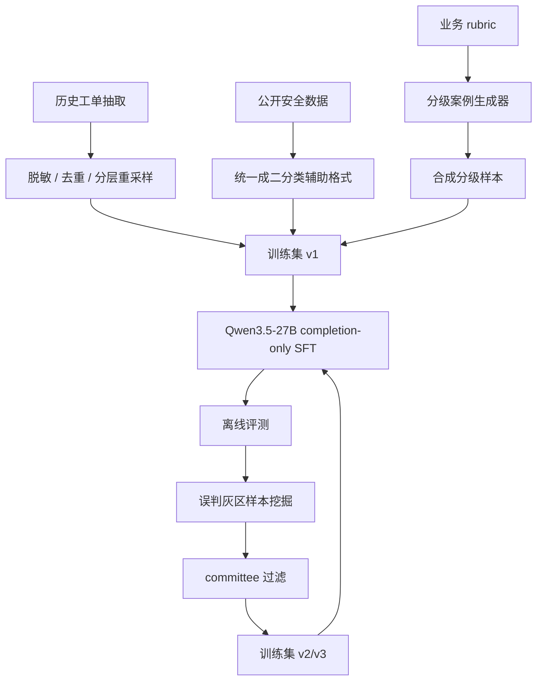
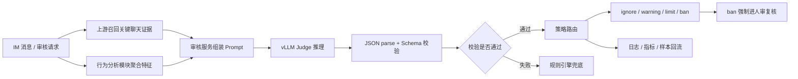

# IM 私聊违规审核模型从 0 到 1 完整理解

这份文档的目的不是教你现场跑代码，而是让你完整理解这个项目在真实生产环境里应该怎么从 0 到 1 设计、开发、训练、上线和迭代。面试时你要传递的信号是：你不是只会调模型，而是能把业务问题拆成数据、模型、工程、评测、上线和治理闭环。

## 1. 项目一句话

把直播/社交业务里的 IM 私聊审核，从“只看聊天文本的安全/不安全二分类”升级成“融合聊天语义和用户行为证据的多任务审核 Judge”，让模型一次性输出风险等级、违规判定、处置建议和可解释依据，并能支撑真实线上灰度和人审复核。

核心输出不是一个简单的 `unsafe`，而是：

```json
{
  "risk_level": "low_risk | mid_risk | high_risk",
  "topic": "代刷/包榜 | 诈骗引流 | ... | 无主题",
  "correlation_analysis": "语义和行为如何相互印证",
  "final_judgment": "exist_violation | not_exist_violation",
  "judgment_basis": "为什么够得上这个违规标准",
  "handling_suggestion": "ignore | warning | limit_account | ban_account"
}
```

## 2. 业务背景怎么讲

直播和社交业务里，IM 私聊是用户沟通的核心链路，也是黑灰产高发区。典型风险包括代刷包榜、诈骗引流、色情诱导、私下交易、辱骂攻击、未成年保护、违禁品交易等。

原系统通常是“规则引擎 + 文本二分类模型”：

- 规则引擎擅长命中强关键词和固定阈值，但维护成本高，话术一变就漏。
- 文本二分类模型只能判断有没有风险，不能告诉业务风险多严重、该警告还是限号还是封号。
- 原系统只看聊天文本，无法利用异地登录、搜索 UID、关注、进房、麦上互动、T 豆消费、打赏冲榜等行为侧证据。
- 真实灰区往往不是“文本一眼违规”，而是“语义很淡，但行为已经异常”，例如聊天里只说“今晚老规矩”，但 30 分钟内给陌生主播打赏 8000 元。

所以业务真正需要的是一个能做联合判断的审核 Judge：看懂聊天，也看懂行为，并且输出可路由、可解释、可复核的结构化结论。

## 3. 从 0 到 1 的需求拆解

第一步不是选模型，而是把业务目标拆成机器学习任务。

### 3.1 输入是什么

输入由三块组成：

- `audit_scene`：审核场景和用户关系，例如聊天类型、亲密度、登录、关注、进房、消费摘要。
- `chat_evidence_list`：聊天证据，通常是上游召回或人审标注出的关键消息，每条包含原文、时间、风险点。
- `behavior_abnormal_list`：行为异常证据，例如短时高频大额打赏、批量私聊投递、异地登录后搜索目标主播。

为什么不直接喂原始行为打点？因为原始行为一天可能几百到上千条，直接拼进 prompt 会超长、噪声大、延迟高。生产里更合理的是由上游行为分析模块先做聚合，把模型需要的信号浓缩成结构化摘要。

### 3.2 输出是什么

输出拆成三层：

- `final_judgment`：是否违规，给召回链路、统计口径和大盘过滤用。
- `risk_level`：风险严重程度，给看板、策略迭代和灰区分析用。
- `handling_suggestion`：处置建议，给下游处置系统和人审队列用。

这三层不能简单互相映射。比如 `high_risk` 不一定直接 `ban_account`，如果只有语义重但行为不印证，生产上可能更适合先 `limit_account` 或进入人审。面试里要强调：这就是为什么要多任务学习，而不是二分类后写规则。

### 3.3 解释字段为什么重要

`correlation_analysis` 解释语义和行为如何呼应；`judgment_basis` 解释为什么符合某个违规标准。

这两个字段的价值在生产里很实际：

- 人审复核员不用从头看完整证据。
- ban 这种重处罚必须有可解释依据。
- 客诉回溯时能看到模型当时为什么判断。
- 后续错误分析能区分“结论错”还是“解释错”。

## 4. 违规体系怎么设计

这个项目不是把“违规”当成一个大标签，而是先构建业务 taxonomy。

一级主题共 11 类：

- 代刷/包榜
- 色情诱导
- 诈骗引流
- 私下交易
- 政治敏感
- 辱骂攻击
- 未成年保护
- 版权侵犯
- 虚假信息
- 自伤诱导
- 违禁品交易

每个一级主题再拆成若干子主题，总计 47 个子主题。每个子主题都写 low/mid/high 三级 rubric。

这样做的原因是：模型学的不是一个抽象的“危险”，而是业务可执行的判断标准。例如代刷/包榜：

- `low_risk`：只是讨论榜单玩法或正常送礼，没有代刷意向。
- `mid_risk`：暗示冲榜、返利、老规矩、互送，但金额、时间、对象不完整。
- `high_risk`：明确约定金额、榜单位次或时间，并且行为侧出现突发大额打赏。

面试里可以说：我先把“业务口径”转成“模型可学习的监督信号”，这是项目成败的第一步。

## 5. 数据从哪里来

训练数据不是单一来源，而是四类数据组合。

### 5.1 历史审核工单

历史工单是主数据源。处理流程：

1. 从线上审核系统抽取 IM 私聊工单。
2. 做脱敏：用户 ID hash、金额区间桶化、隐私字段清理。
3. 按 11 类主题和 4 类处置标签分层重采样。
4. 压缩纯安全闲聊长尾，避免训练集被 `not_violation` 淹没。
5. 保留三段输入证据和人审最终结论。

这部分大约 24.5K 条，优点是真实，缺点是长尾主题少、risk_level 标签不总是完整。

### 5.2 分级案例生成器

为补齐长尾和 risk_level 边界样本，按 `low_risk / mid_risk / high_risk` 分别准备种子工单，微调专属案例生成器，生成结构化三元组：

- `audit_scene`
- `chat_evidence_list`
- `behavior_abnormal_list`

生成器不是自由胡编，而是受主题、risk_level、证据组合约束。比如生成“仅语义强、行为弱”“语义弱、行为强”“语义和行为都强”等不同证据结构。

这部分大约 11.6K 条。面试中要承认合成数据有分布偏移风险，然后说清楚控制方式：真实 seed、schema 校验、证据冲突过滤、最终用人审测试集验证。

### 5.3 灰区强化样本

这是项目最有工程味的部分。流程是：

1. 用上一轮 Judge 在工单池和合成池上预测。
2. 找出模型错判样本，尤其是 `gold=exist_violation` 但模型判 `not_exist_violation` 的灰区。
3. 用 `self + Qwen3.5-flash + 线上规则引擎` 做 committee 复核。
4. 如果三方都认为不是违规，就不回灌；否则保留为 hard sample。
5. 合并进下一轮训练集，从基座模型重新 SFT。

为什么 committee 要异构？因为 self 是当前模型视角，Qwen-flash 是另一个 LLM 视角，规则引擎是非 LLM 视角。三方来源越不一样，一致结论越有参考价值。

### 5.4 公开安全数据

公开数据如 BeaverTails、WildGuardTrain、COLD、Safety-Prompts，主要补强通用文本安全能力，尤其是中英文辱骂、政治敏感、违禁品、自伤等长尾表达。

它们没有业务侧 `risk_level` 和 `handling_suggestion` 标签，所以只参与 `final_judgment` 二分类辅助任务，不应该污染处置档位学习。

## 6. 模型方案怎么选

### 6.1 为什么不用纯 prompt API

早期可以试 Qwen3.5-plus、Qwen3.6-plus 这种 API zero-shot 或 few-shot，但纯 prompt 有三个问题：

- 输入结构是业务专属的“聊天 + 行为”证据，通用 API 没见过这种分布。
- 三层输出容易互相矛盾，例如 `high_risk` 却给 `warning`。
- 处置档位是公司内部策略，不是通用安全模型天然具备的能力。

所以 prompt API 可以做 baseline，但不适合作为最终生产主链路。

### 6.2 为什么选 Qwen3.5-27B

模型容量对灰区判断很关键。8B 在 mid_risk 和 handling 上掉点明显；35B-A3B MoE 成本更优但效果略低；27B 稠密版在效果、稳定性、部署复杂度之间比较均衡。

面试里不需要死背所有数值，但要记住判断逻辑：不是越大越好，而是看灰区准确率、处置 FPR、延迟和部署成本。

### 6.3 为什么单模型多任务

三层任务共享大量表示：

- 判断是否违规帮助模型先学会“什么是风险”。
- 风险等级帮助模型区分 low/mid/high 的严重程度。
- 处置建议帮助模型学习业务动作边界。

如果拆成三个模型，成本更高、延迟更高、输出还可能互相矛盾。多任务 SFT 能让模型把业务逻辑内化到同一个输出协议中。

## 7. Prompt 和训练格式

训练 prompt 包含：

- 角色定义：直播平台 IM 私聊违规审核 Judge。
- 违规主题清单。
- 当前主题 rubric。
- 处置策略表。
- 审核场景。
- 聊天证据。
- 行为异常证据。
- JSON Schema 输出要求。

输出字段顺序固定：

1. `risk_level`
2. `topic`
3. `correlation_analysis`
4. `final_judgment`
5. `judgment_basis`
6. `handling_suggestion`

为什么 `correlation_analysis` 放在 `final_judgment` 前面？可以理解为让模型先整理语义和行为证据链，再做最终判定，类似显式推理步骤，但输出仍然是业务可读解释。

训练采用 completion-only loss，只对 assistant 输出部分算 loss。原因是 prompt 里有大量 rubric 和策略表，如果对 prompt 也算 loss，模型会浪费容量学习复述输入，而不是学习怎么输出正确 JSON。

## 8. 训练流程

真实生产里的训练流程可以这样理解：



关键超参数：

- epoch：2
- learning rate：2e-6
- batch size：64
- context length：8192
- warmup ratio：0.03
- bf16 + gradient checkpointing

为什么只训 2 epoch？因为更多 epoch 容易记住工单话术，离线指标开始掉。面试时可以讲：我不是盲目堆 epoch，而是用验证集看过拟合拐点。

## 9. 推理和服务架构

线上推理链路：



生产里模型不应该直接裸接处置系统。中间必须有后处理层：

- JSON 解析。
- 枚举字段校验。
- 逻辑一致性校验。
- 失败 fallback。
- 重处罚人审复核。
- 结构化日志。

`ban_account` 尤其不能直接执行，应该进入人审复核队列。这样既能利用模型召回高风险，也能控制误杀和客诉。

## 10. JSON 解析和兜底

模型输出虽然要求 JSON，但生产里仍可能出现：

- JSON 后面多一句解释。
- 缺字段。
- 枚举值拼错。
- 字段逻辑冲突。

处理策略：

1. 先从生成文本中截取第一个完整 JSON object。
2. `json.loads` 成功后补默认字段。
3. 如果失败，用正则提取 `risk_level / final_judgment / handling_suggestion`。
4. 如果仍失败，默认走 `not_exist_violation + ignore`，并记录日志。
5. 如果出现 `not_violation + ban_account` 这种冲突，按安全策略降档或进入人工复核。

这部分很重要，因为生产事故经常不是模型不会判断，而是协议和后处理没兜住。

## 11. 评测体系

不要只说 accuracy。这个项目需要多层评测。

### 11.1 自构 IM 审核测试集

1024 条人工标注样本，覆盖三段输入证据、11 类主题、3 个风险等级和 4 个处置档位。3 名标注员独立打分，多数票或仲裁。

标注一致性：

- Fleiss Kappa：多标注员一致性。
- ordinal Krippendorff alpha：risk_level 是有序变量，low 和 high 错得更严重。
- Cohen's Kappa：成对一致性校验。

### 11.2 P0/P1 工单回流测试集

从线上真实高风险工单抽取，验证模型在真实事故复盘和复杂证据链上的表现。这组样本更偏高风险，是业务上线说服力最强的评测。

### 11.3 公开 benchmark

ToxicChat、HarmBench、XSTest 用于确认通用文本审核能力没有退化。尤其 XSTest 能监控 false positive，避免模型为了抓违规而过度审查。

### 11.4 核心指标

- `final_judgment`：Accuracy、Precision、Recall、F1、FPR、AUPRC。
- `risk_level`：macro-F1、per-level accuracy、per-topic accuracy。
- `handling_suggestion`：macro-F1、confusion matrix、ban_account FPR。

为什么用 macro-F1？因为处置档位不均衡，`ban_account` 很少但业务代价最高。micro-F1 会被 `ignore` 大类掩盖。

## 12. 消融实验怎么讲

消融实验是证明“每个模块都有用”的关键。

最重要的几组：

- 去掉行为证据：指标大幅下降，证明语义 + 行为融合是核心贡献。
- 去掉 refinement：灰区 mid_risk 掉点，证明难样本回灌有效。
- 去掉公开数据：通用 benchmark 掉点，说明公开数据主要补文本侧泛化。
- 去掉 handling 任务：binary 影响不大，但处置建议能力缺失，说明多任务必要。
- 换小模型 8B：灰区和处置掉点，说明容量是瓶颈之一。
- 换 MoE：效果略低但成本更优，可作为后续优化方向。

面试时要把消融和结论绑在一起，不要只报表。比如：“去掉行为证据 risk macro-F1 掉 7.8pp，所以这个项目不是普通文本 moderation，而是业务行为证据融合带来的收益。”

## 13. 灰度上线怎么做

生产上线不要一步全量。

阶段 1：1% shadow

- 模型只预测，不执行处置。
- 和线上规则引擎并行。
- 看分布、解析失败率、和人审结论差异。

阶段 2：10% 小流量

- 模型结果进入处置链路。
- 规则引擎作为兜底。
- 重点监控 ban FPR、客诉率、人审改判率。

阶段 3：全量

- 模型成为主链路。
- 规则引擎保留强约束兜底。
- 按主题、风险等级、处置档位持续监控。

真实工程里一定要准备回滚策略：模型版本、数据版本、prompt 版本、rubric 版本都要能追溯。

## 14. 线上监控指标

模型上线后，不是看一次离线评测就结束。要持续监控：

- 请求量、QPS、P95/P99 延迟。
- JSON 解析失败率。
- 各字段分布：risk_level、final_judgment、handling_suggestion。
- ban_account 占比和 FPR。
- 人审改判率。
- 用户申诉率和客诉率。
- 上游行为特征异常，例如礼物金额突然偏大。
- 分主题召回率和误杀率。
- 兜底规则触发比例。

如果某天 ban FPR 突然升高，不一定是模型变坏，可能是上游行为模块写错了默认值。这类问题要靠特征分布监控发现。

## 15. 常见生产风险

### 15.1 上游特征污染

行为证据是最大收益点，也是最大风险点。如果 `gift_total_value`、进房次数、关注状态等字段异常，模型会被误导。解决方式是特征范围校验、异常分布报警、关键字段缺失时降级。

### 15.2 训练和线上分布不一致

线下训练可能有 4 到 5 条聊天证据，线上只给 1 到 3 条。解决方式是在线下补“短证据列表”样本，并保证线上截断策略和训练一致。

### 15.3 重处罚误杀

ban 的业务代价极高，所以模型可以给 `ban_account` 建议，但不能直接执行。必须人审复核，且要单独监控 ban FPR。

### 15.4 合成数据偏移

合成数据会带来模板化表达。解决方式是用真实 seed、schema 校验、证据一致性过滤、控制合成占比，并用纯人工测试集做最终验证。

### 15.5 解释幻觉

模型可能结论对但解释错。生产上要区分 conclusion error 和 reasoning error。优先保证判定准确，解释错误作为复核辅助和后续数据分析信号。

## 16. 真实开发分工

这个项目在公司里通常不是一个人独立完成所有链路，而是你作为模型 owner 推动多方协作。

模型侧负责：

- 任务定义和输出协议。
- rubric 结构化。
- 训练数据构造。
- SFT / refinement。
- 离线评测和消融。
- 模型权重交付。
- 推理参数建议。

数据团队负责：

- 历史工单抽取。
- 行为打点聚合。
- 脱敏和合规处理。
- 数据版本管理。

工程团队负责：

- vLLM 部署。
- 审核服务接入。
- JSON 校验和 fallback。
- 策略路由。
- 监控告警。

业务运营负责：

- 违规主题定义。
- 处置策略。
- 标注规范。
- 人审复核和客诉反馈。

面试里你要表现出：我不是只训练模型，我知道上下游怎么协作，也知道模型上线后谁消费我的输出。

## 17. 你在面试中可以这样讲项目

### 17.1 总体讲法

“我做的是直播/社交 IM 私聊审核 Judge。原来系统只做文本二分类，不能融合行为证据，也不能支撑差异化处置。我先和业务一起把 11 类违规主题拆成 47 个子主题，设计 low/mid/high 分级 rubric，再把输出协议设计成风险等级、违规判定、处置建议和两段解释。数据上用历史工单、分级合成、灰区 refinement 和公开安全数据组合，模型上用 Qwen3.5-27B 做 completion-only 多任务 SFT。最终核心收益在 mid_risk 灰区，尤其是语义很淡但行为异常的样本。”

### 17.2 面试官问“难点是什么”

答法：

“最大难点不是 SFT 本身，而是异构证据融合和业务处置边界。聊天文本和行为打点不是同一种信息，直接 prompt 容易让模型忽略行为或输出自相矛盾。所以我把上游行为先聚合成 `behavior_key_summary` 和 `behavior_abnormal_list`，再通过统一 JSON prompt 输入模型。同时把 `risk_level / final_judgment / handling_suggestion` 都作为训练目标，让模型显式学习三层之间的关系。”

### 17.3 面试官问“为什么不用规则”

答法：

“规则在 high_risk 强关键词场景还可以，但 mid_risk 灰区不行。比如‘今晚老规矩’本身不违规，但如果配合 30 分钟 8000 元打赏，就很像代刷包榜。这个组合不是单独关键词或单独阈值能稳定覆盖的，需要模型联合理解语义和行为。”

### 17.4 面试官问“怎么保证不上线翻车”

答法：

“我不会让模型直接全量接管。先 1% shadow，只入库不处置；再 10% 小流量，规则引擎兜底；最后全量。期间重点看 ban FPR、JSON 解析失败率、人审改判率、客诉率和上游行为特征分布。ban_account 必须进人审复核，不直接执行。”

## 18. 如果真实让你落地，你要按这个顺序做

1. 对齐业务主题和处置策略，写出 11 类主题和 47 个子主题 rubric。
2. 定义输入输出 JSON Schema，明确每个字段谁生产、谁消费。
3. 抽取历史工单，做脱敏、去重、分层采样。
4. 建立标注规范和 1024 条核心测试集。
5. 训练 baseline：prompt API、规则引擎、纯文本模型。
6. 构建多任务 SFT 数据，训练 Qwen3.5-27B。
7. 做分级合成数据，补长尾和边界样本。
8. 做 refinement，回灌模型最容易错的灰区样本。
9. 跑完整评测：内部测试集、P0/P1、公开 benchmark、消融。
10. 做推理服务：vLLM、JSON 校验、fallback、策略路由。
11. 做灰度上线：shadow、小流量、全量。
12. 建监控和回流：解析失败、ban FPR、客诉、人审改判、特征漂移。
13. 定期迭代：rubric 更新、样本回流、版本管理、重新评测。

## 19. 这个项目的核心竞争力

这个项目好讲，是因为它不是一个“我拿开源数据训了个分类器”的项目，而是一个完整的工业 ML 系统：

- 有真实业务痛点。
- 有输入输出协议设计。
- 有 taxonomy 和 rubric。
- 有多源数据构造。
- 有合成数据和难样本闭环。
- 有多任务 SFT。
- 有评测和消融。
- 有线上部署和灰度。
- 有监控、兜底、人审复核。
- 有后续成本优化方向，如 MoE、蒸馏、AWQ INT4。

你面试时要反复强调：我解决的不是一个模型指标，而是一个能在生产里被业务消费、能灰度上线、能持续迭代的审核系统。

